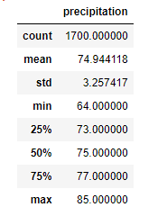
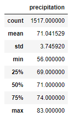

# surfs_up UofT Module 9 Challenge

# Overview of the Analysis
## Purpose
The client would like to know more about the impact of weather in setting up a shop on the beach in Hawaii. They have provided a database of nearly 17 years worth of weather data. From past experience they are most concerned with poor weather in December and  the focus of this analysis will be to compare June to December temperatures.

# Results
## Figures

Figure June Temperature summary statistics

Figure December Temperature summary statistics

## Major points
- The average temperature for June is 3.9 degrees fahrenheit higher than in for December
- The lowest recorded temperature for December is 56 fahrenheit which is 8 degrees lower than for June
- Assuming normal distribution of temperatures June temperature ranges between 81.5 and 68.4 fahrenheit (19 times out of 20)
- Assuming normal distribution of temperatures December temperature ranges between 78.5 and 63.6 fahrenheit (19 times out of 20)

# Summary
## Findings

Comparing June and December temperatures for the nearly 17 years in the database provided, the average temperature is about 3 degrees cooler in December. The expected ranges of temperatures are also about 3 degrees cooler in December than in June. These results do not show a large change in average temperature between June and December.

## Recommendations for further Analysis

The client is concerned about poor weather in December interupting their potential business. Since the analysis of the temperatures between June and December have shown a minor change, other factors should be investigated. The database also contains precipitation amounts. Additional queries for the precipitation for June and December could be run to compare precipitation for the two months. Examples of the queries is as follows:

- session.query(Measurement.date, Measurement.prcp).filter(extract('month', Measurement.date) == 6).all()
- session.query(Measurement.date, Measurement.prcp).filter(extract('month', Measurement.date) == 12).all()
